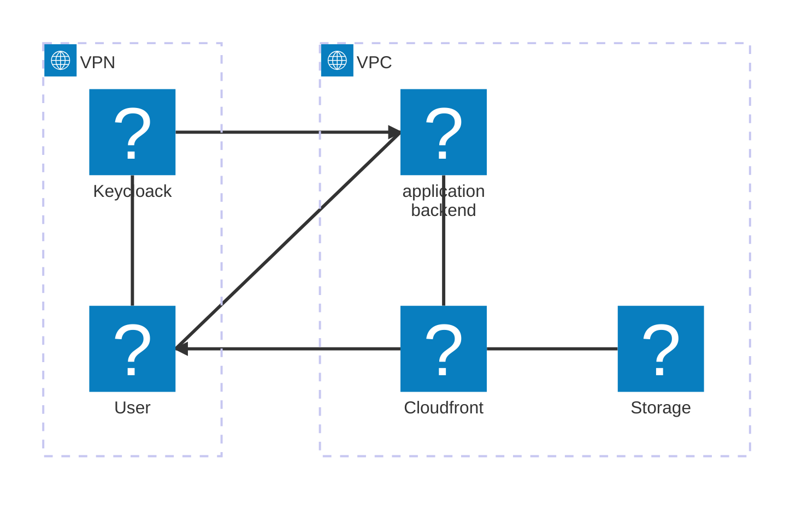

```mermaid
architecture-beta
    group vpn(internet)[VPN]
    group vpc(internet)[VPC]
    
    service keycloack(logos:aws-kms)[Keycloack] in vpn
    service desktop(logos:microsoft-windows-icon)[User] in vpn
    service cloudfront(logos:aws-cloudfront)[Cloudfront] in vpc
    
    service bucket(logos:aws-s3)[Storage] in vpc
    service application(logos:aws-ec2)[application backend] in vpc

    cloudfront:R -- L:bucket
    desktop:T -- B:keycloack
    keycloack:R -- L:application
    desktop:R --> L:application
    cloudfront:T -- B:application
    cloudfront:L --> R:desktop
    
```
    

    

